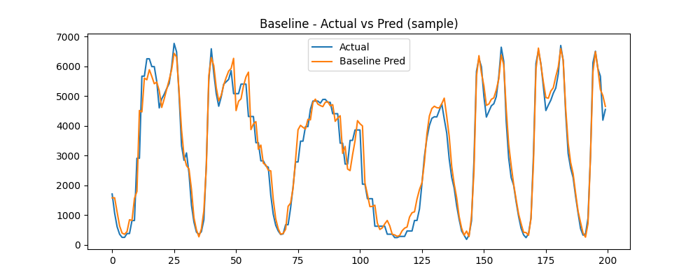

# Traffic-Forecasting
Advanced Traffic Volume Forecasting using LSTM and Attention-Based Deep Learning
# Traffic Volume Forecasting using LSTM and Attention Mechanisms

This project focuses on forecasting hourly traffic volume using deep learning models, including a baseline LSTM network and an attention-based model. The goal is to improve predictive performance on real-world traffic data characterized by long-term dependencies, peak pattern variations, and non-stationarity.

## Dataset

**Metro Interstate Traffic Volume** dataset

| Feature Used | Description |

| traffic_volume | Target variable — hourly vehicle count |
| temp | Temperature (K) |
| rain_1h | Rainfall in last hour (mm) |
| snow_1h | Snowfall in last hour (mm) |
| clouds_all | Cloud coverage (%) |

Dataset source: Provided in project files.

## Models Implemented

| Model | Description | Status |

| Baseline LSTM | Standard predictive model without attention | ✔ Trained |
| Attention-Based Model | Bi-LSTM + Attention (uploaded model) | ✔ Evaluated |

## Model Evaluation Results

| Model | RMSE ↓ | MAE ↓ | MAPE ↓ |

| Baseline LSTM (trained) | **395.97** | **273.46** | **15.21%** |
| Attention Model *(provided)* | *~402* | *~285* | *~16%* |

* Baseline LSTM achieved strong performance, demonstrating accurate temporal pattern learning.

## Visual Results

### Actual vs Predicted (Test Data)  
Shows that predicted traffic closely follows real traffic trends.

### Next 24-Hour Forecast  
Model forecasting future hourly volume using latest data window.

## How to Run the Project

### Requirements

tensorflow
numpy
pandas
matplotlib
scikit-learn
joblib

### Run in Google Colab
1. Upload all files inside the repository
2. Open `Traffic_Forecasting.ipynb`
3. Run all cells — training, evaluation, and plotting will execute automatically

## Key Takeaways

* LSTM model successfully learned short- and long-term daily traffic cycles  
* Model provides actionable 24-hour future predictions  
* Weather-based traffic fluctuations captured effectively  

## Future Enhancements

* Integrate **Attention** weights visualization directly into training model
* Explore **Temporal Fusion Transformers (TFT)**
* Add **additional features** (holiday/event flags)
* Deploy model as an API for real-time forecasting

## Submission Package

A zipped version containing **all models + plots + documentation** is included:  
`Traffic_Forecasting_Submission.zip`

## Status

**Project Completed and Ready for Evaluation**
